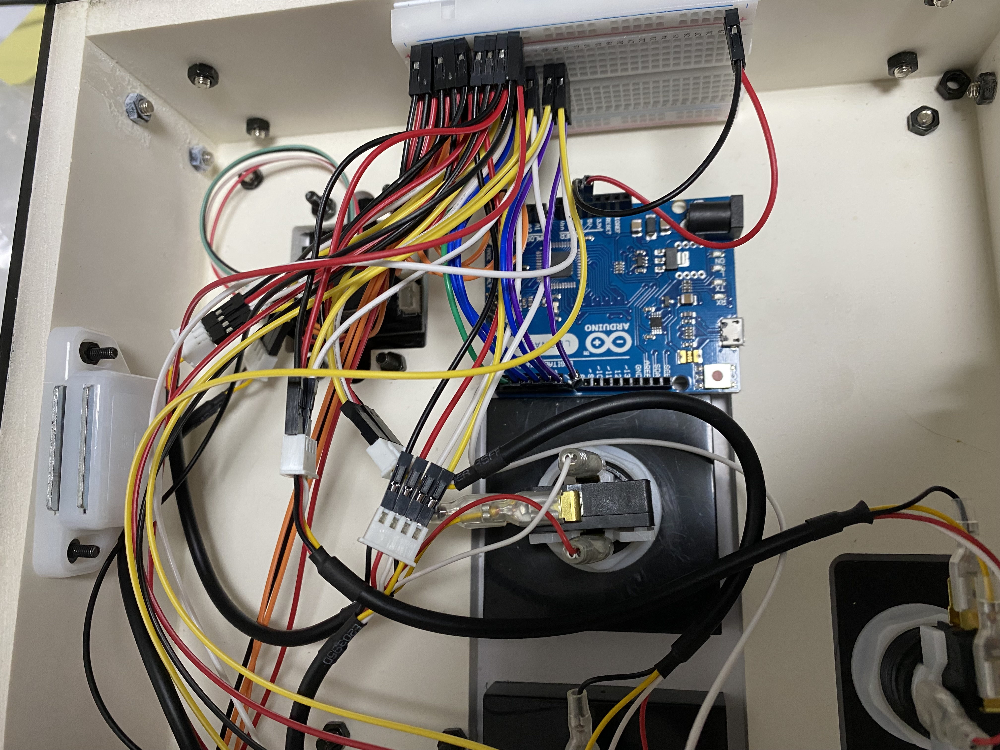
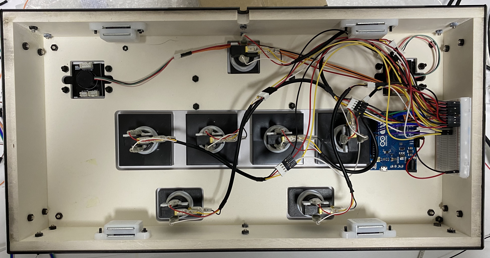
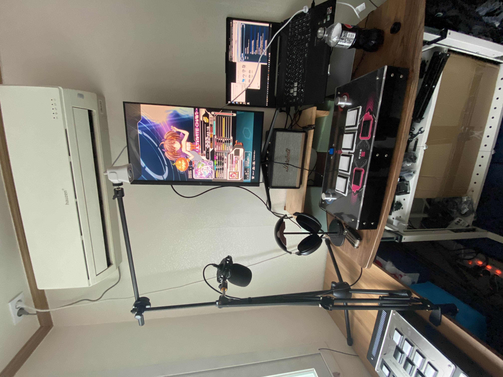

# SVSE5 PCB Remodeling

https://www.youtube.com/watch?v=yE9KfZ4eaBQ

> 후반 부에 갑자기 연결이 끊기는 모습을 보실 수 있습니다.

중고나라에서 PCB 기판이 고장난 SVSE5를 샀습니다.

> 고장난 줄 몰랐는데.. 역시 중고나라..

피같은 돈 15만원이 날라가게 생겨서 굉장히 마음이 아팠습니다.

어떻게든 고쳐서 써보자는 의도로 이 Project를 시작했습니다.

기존 PCB를 Arduino Leonardo로 바꿔 새 생명을 불어넣어 봤습니다.

문제있는 PCB 기판입니다.

옛 버전이라, 마우스 입력 고정이고

게임을 30분 정도 하면 제멋대로 끊겼다 연결되었다.. 아주 난리입니다.

아마 파워 서플라이 쪽 부품이 고장이 아닌가 싶구요.

정교하게 만들어져 있다보니 함부로 건들지 못해서 그냥 PCB를 Arduino로 바꿔야겠다고 생각했습니다.

바꾼 김에, 마우스 입력도 조이스틱 입력으로 변경하구요.

모든 부품을 Arduino에 연결했습니다.

https://www.youtube.com/watch?v=eEEsf6Q9ZHI

바꾸고 난 다음부터는 인식 불량없이 아주 매끄럽게 잘 동작합니다.

기분이 너무 좋네요.

로터리 엔코더를 인식시키는게 조금 난항이었습니다.

https://www.youtube.com/watch?v=z9_P43dfaFo

이런 영상들을 보면서, 기술을 직접 익혔습니다.

노브 인식 완료 후

Millis 함수를 사용한 디바운싱 작업까지 완료했습니다.

기본적인 기능들은 전부 작업 완료했고, 매크로 기능 등 게임 플레이에 도움을 주는 부가적인 기능들을 만들어볼까 구상 중입니다.

> 작업 완료 후 I lv.18 UC

## Badges

<!-- Badges -->

## Reference

1. [https://github.com/MHeironimus/ArduinoJoystickLibrary](https://github.com/MHeironimus/ArduinoJoystickLibrary)

## Documentation

* [프로젝트 변경 사항](https://github.com/rhea-so/SVSE5-PCB-Remake/blob/main/CHANGELOG.md)
* [프로젝트 발전 방향](https://github.com/rhea-so/SVSE5-PCB-Remake/blob/main/ROADMAP.md)

## Contribute

부탁드립니다. 이 프로젝트는 여러분의 기여를 바라고 있습니다. 기여를 해주세요.  
기여를 하는 법은 크게 어렵지 않습니다!!

* [당장 기여하는 방법 알아보기](https://github.com/rhea-so/SVSE5-PCB-Remake/blob/main/CONTRIBUTING.md)
* [기여 해주신 고마운 분들](https://github.com/rhea-so/SVSE5-PCB-Remake/blob/main/CONTRIBUTORS.md)

## Questions

* GitHub - [open issue](https://github.com/rhea-so/SVSE5-PCB-Remake/issues)
* Email - [jeonghyeon.rhea@gmail.com](mailto:jeonghyeon.rhea@gmail.com?subject=[GitHub]%20Project%20Moon%20Community-Question)

### License

[MIT License](https://github.com/rhea-so/SVSE5-PCB-Remake/blob/main/LICENSE)
